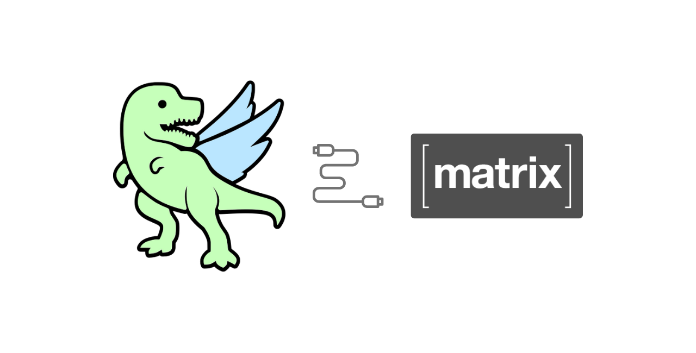

# HolopinMaubot

HolopinMaubot is a [Maubot](https://maubot.xyz/) plugin to award [Holopin](https://www.holopin.io/) badges and embrace the awesomeness of digital badges in the [Matrix](https://matrix.org/) network. 🎉

## Setup

First, you need to get an API key for the issuing Holopin organization.

Enter your API key in the base-config.yaml. You can also change the base-config.yaml from within the Maubot Manager after you created the instance.
